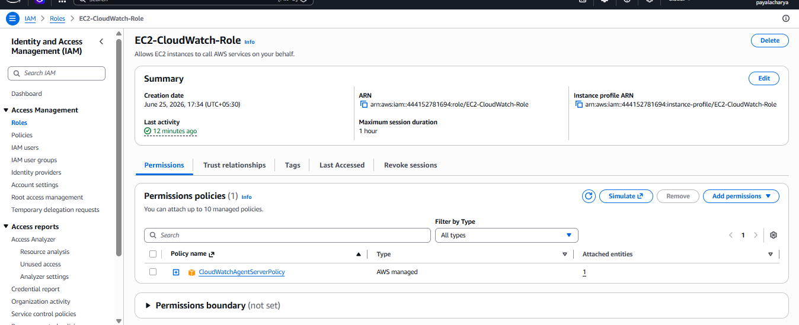
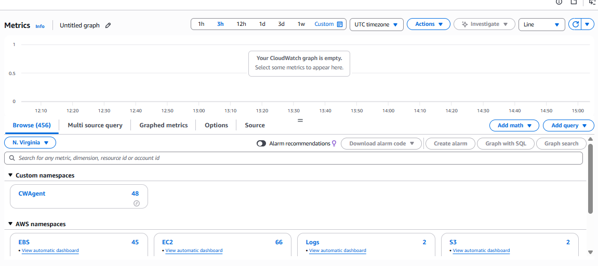
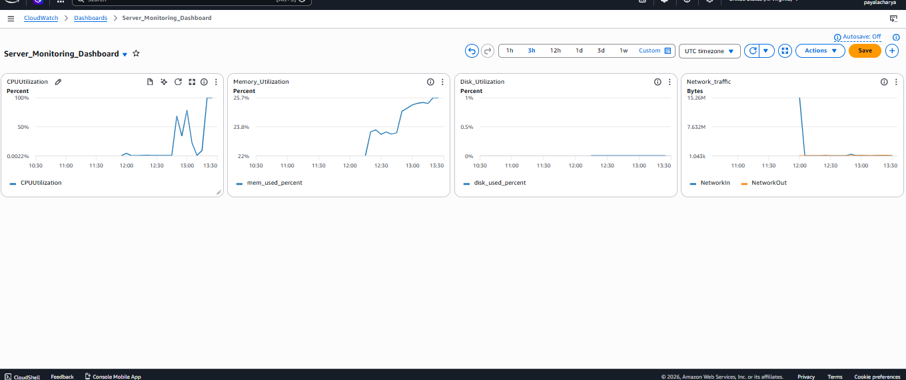
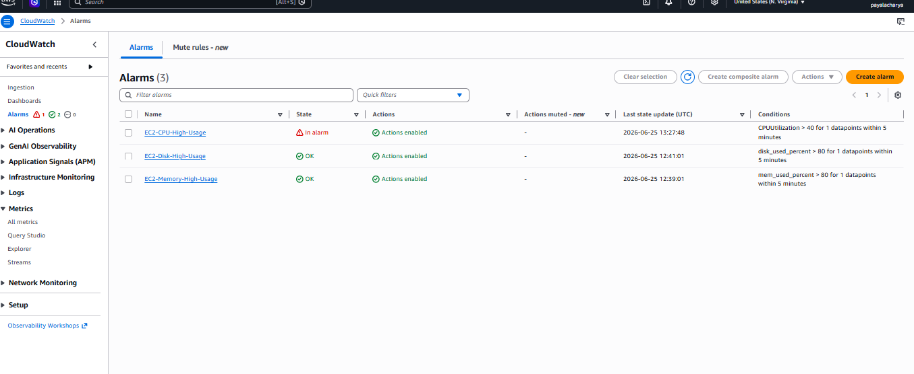
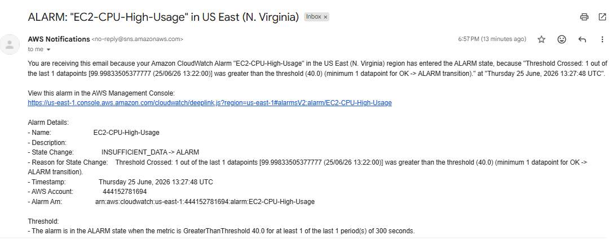

# AWS CloudWatch Monitoring & Alerting Project

## Project Overview

This project demonstrates how to monitor an Amazon EC2 instance using AWS CloudWatch, collect system metrics through the CloudWatch Agent, create dashboards, configure alarms, and receive email notifications using Amazon SNS.

## Architecture

EC2 Instance → CloudWatch Agent → CloudWatch Metrics → CloudWatch Alarm → SNS Topic → Email Notification

## Services Used

* Amazon EC2
* Amazon CloudWatch
* CloudWatch Agent
* Amazon SNS
* IAM

## Project Implementation

### Step 1: Launch EC2 Instance

Created an Amazon EC2 instance to serve as the monitoring target.

**Screenshot**

---

### Step 2: Create and Attach IAM Role

Created an IAM role with permissions required for CloudWatch Agent to publish metrics to CloudWatch.

**Screenshot**

---

### Step 3: Install and Configure CloudWatch Agent

Installed CloudWatch Agent on the EC2 instance and configured it to collect system-level metrics such as:

* CPU Utilization
* Memory Usage
* Disk Usage
* Network Metrics

**Screenshot**

---

### Step 4: Create CloudWatch Dashboard

Created a CloudWatch Dashboard to visualize system performance metrics in real time.

**Screenshot**

---

### Step 5: Configure SNS Topic

Created an SNS Topic and subscribed an email address for alert notifications.

**Screenshot**

---

### Step 6: Create CloudWatch Alarm

Configured a CPU Utilization alarm to monitor resource usage and trigger notifications when thresholds are exceeded.

**Screenshot**

---

### Step 7: Verify Email Notification

Validated the monitoring solution by triggering the alarm and successfully receiving an email notification through SNS.

**Screenshot**

---

## Key Outcomes

* Implemented infrastructure monitoring using AWS CloudWatch.
* Configured CloudWatch Agent for custom metrics collection.
* Built a monitoring dashboard for operational visibility.
* Created automated alerting using CloudWatch Alarms.
* Integrated SNS email notifications for proactive incident response.

## Skills Demonstrated

* AWS CloudWatch
* Amazon EC2
* IAM Roles & Policies
* Amazon SNS
* Monitoring & Alerting
* Cloud Operations
* Infrastructure Monitoring
* Incident Response
* Linux Administration
* AWS Cloud Practitioner Concepts

## Author

Payal Acharya

AWS Certified Cloud Practitioner | Cloud Operations & Infrastructure Enthusiast
